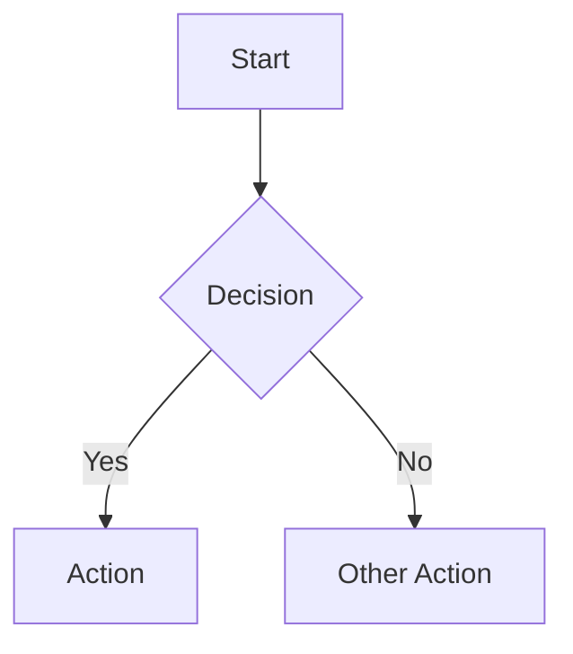

# Agent Writing Guide for rmdp Documents

Guidelines for AI agents producing documents intended for consumption via **mdr** — Markdown RSVP (rapid srial visual presentation) TUI reader.

The reader renders one word at a time at high speed, with a persistent table-of-contents sidebar and a split-pane viewer with a rich 'full doc' display.

---

## Core Principles

1. **Headers are navigation.** The  reader builds a collapsible ToC from your headings. Every heading creates a jump target. Structure your document so a human scanning the ToC alone can grasp the document's shape.

2. **Verbosity is OK.** Rate of consumption here is high - feel free to give word-of-mouth style descriptiosn of problem context, solution paths, etc.

3. **Block Rendering is OK.** Normal markdown affordances still exist - viewer has access to traditional rendering of the document so the user can pause to examine physically structured text such as code, tables, mermaid, etc.

---

## Document Structure

### Heading Hierarchy

Use headings to create a **scannable outline** with clear nesting.

Rules:

- **Always start with a single H1.** This becomes the document root in the ToC.
- **Do not skip levels.** Going from H1 to H3 without an H2 creates confusing ToC nesting.
- **Keep heading text short** — under 50 characters. The sidebar truncates long titles.
- **Make headings self-descriptive.** Prefer "Error Handling Strategy" over "Errors". The reader may jump directly to a section from the ToC without reading prior context.

### Section Length

- **Target 100–500 words per leaf section.** At 300 WPM, this is 20–60 seconds of reading — long enough to develop a point, short enough to maintain focus.
- **If a section exceeds ~700 words, split it.** Introduce a subsection at the natural break point.
- **The first section after the title should be an executive summary** of 50–150 words. This orients the reader before RSVP begins.

### Front-loading

The reader may skim sections via ToC navigation. Within each section:

1. **First sentence = thesis.** State the section's key claim or purpose.
2. **Middle = evidence.** Supporting detail, code references, data.
3. **Last sentence = implication.** What follows from this, or a transition to the next section.

This inverted-pyramid structure ensures that even partial reads of a section capture the essential point.

---

## Prose Style for RSVP

LLMs, via rlhf and engagement tuning have converged on bullet-driven writing style. Here in RSVP context, we do not shy away from longform prose writing.

### Punctuation and Pacing

The RSVP engine applies smart pacing — longer pauses on sentence-ending punctuation, shorter pauses on commas, longer pause on paragraph breaks, etc. Some particulars:

- **Use em dashes for asides.** They receive a 1.5× pause — enough to signal a parenthetical without a full stop.
- **Use colons before lists or explanations.** The reader gets a brief pause before the payload.
- **Use ellipses deliberately.** Three dots in RSVP are three separate pause events that can disrupt flow, but also can allow think-time after, eg, conceptually rich content.

---

## Inline Formatting

The reader handles *italic*, **bold**, and `code` inline formats in a natural way. Use them where useful.

## Diagrams

### Mermaid Diagrams

Use fenced code blocks with the `mermaid` language tag:

````markdown

````

---

## Anti-patterns

Avoid these patterns that degrade the RSVP reading experience:

| Anti-pattern | Problem | Fix |
|---|---|---|
| Tiny subsections | < ~75 words in a prose section, forcing too-frequent restarts / insufficient density | Combine more context |
| Wall of prose | 700+ words with no heading break | Split into subsections |
| Back-to-back blocks | Two code blocks with no prose between | Add a connecting paragraph |
| Pronoun chains | "It processes them and sends it to the other one" | Use explicit nouns |
| Heading-only sections | A heading followed immediately by a sub-heading | Add at least one sentence of context |
| Ambiguous "this" | "This is important" — what is? | "This constraint is important" |
| Nested parentheticals | "The agent (which runs (in a container)) fails" | Rewrite as separate sentences |
