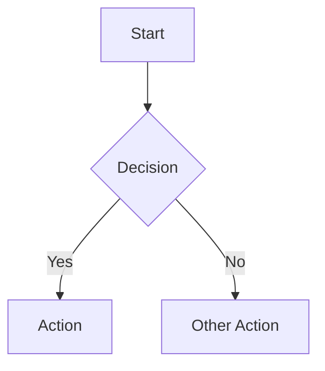

# Agent Writing Guide for rmdp Documents

Guidelines for AI agents producing documents intended for consumption via **rmdp** — the Rapid Markdown Presentation TUI reader.

The reader displays one word at a time at high speed (RSVP), with a persistent table-of-contents sidebar and a split-pane block viewer for code and diagrams. Documents should be structured to exploit these affordances.

---

## Core Principles

1. **Headers are navigation.** The reader builds a collapsible ToC from your headings. Every heading creates a jump target. Structure your document so a human scanning the ToC alone can grasp the document's shape.

2. **Prose is the stream.** Prose sections are tokenized into the RSVP word stream. Write for a reader whose eyes are fixed on a single point. Short, direct sentences land better than complex subordinate clauses.

3. **Blocks are the anchor.** Code blocks and diagrams render in a dedicated pane alongside the RSVP stream. They give the reader a stable visual reference while prose flows past. Place blocks strategically — they are cognitive rest stops.

4. **Formatting is signaling.** Bold, italic, and inline code all render with distinct visual treatment in the RSVP viewer. Use them intentionally, not decoratively.

---

## Document Structure

### Heading Hierarchy

Use headings to create a **scannable outline** with clear nesting:

```markdown
# Document Title
## Major Section
### Subsection
### Subsection
## Major Section
### Subsection
```

Rules:

- **Always start with a single H1.** This becomes the document root in the ToC.
- **Do not skip levels.** Going from H1 to H3 without an H2 creates confusing ToC nesting.
- **Keep heading text short** — under 50 characters. The sidebar truncates long titles.
- **Make headings self-descriptive.** Prefer "Error Handling Strategy" over "Errors". The reader may jump directly to a section from the ToC without reading prior context.
- **Aim for 3–8 sections at the top level.** Fewer than 3 suggests the document is too short to need structure. More than 8 makes ToC scanning costly.

### Section Length

- **Target 100–300 words per leaf section.** At 300 WPM, this is 20–60 seconds of reading — long enough to develop a point, short enough to maintain focus.
- **If a section exceeds 400 words, split it.** Introduce a subsection at the natural break point.
- **The first section after the title should be an executive summary** of 50–100 words. This orients the reader before RSVP begins.

### Front-loading

The reader may skim sections via ToC navigation. Within each section:

1. **First sentence = thesis.** State the section's key claim or purpose.
2. **Middle = evidence.** Supporting detail, code references, data.
3. **Last sentence = implication.** What follows from this, or a transition to the next section.

This inverted-pyramid structure ensures that even partial reads of a section capture the essential point.

---

## Prose Style for RSVP

### Sentence Construction

RSVP removes the ability to regress (re-read). Compensate:

- **Prefer SVO (Subject–Verb–Object) order.** "The agent processes the queue" lands instantly. "The queue, which was previously populated by the dispatcher, is processed by the agent" forces the reader to hold state.
- **One idea per sentence.** If a sentence has a semicolon or more than one conjunction, split it.
- **Keep sentences under 20 words when possible.** Sentences over 30 words become risky at high WPM.
- **Avoid garden-path constructions.** "The agent sent the message failed" forces a re-parse the reader cannot perform.

### Word Choice

- **Prefer concrete nouns over abstractions.** "The function returns a list" over "The operation yields a collection."
- **Repeat key terms instead of using pronouns** when the antecedent is more than one sentence back. RSVP readers lose referent tracking quickly.
- **Use consistent terminology.** If you call it a `WorkGraph` in section 2, do not switch to "task graph" in section 4.
- **Avoid jargon without introduction.** The first use of a technical term should be accompanied by a brief parenthetical or a clause that defines it.

### Punctuation and Pacing

The RSVP engine applies smart pacing — longer pauses on sentence-ending punctuation, shorter pauses on commas. Use this:

- **End important statements with a period.** The 2× pause gives the reader processing time.
- **Use em dashes for asides.** They receive a 1.5× pause — enough to signal a parenthetical without a full stop.
- **Use colons before lists or explanations.** The reader gets a brief pause before the payload.
- **Avoid ellipses.** Three dots in RSVP are three separate pause events that disrupt flow.

### Paragraph Breaks

Every paragraph break generates a 2.5× pause in the RSVP stream. Use them:

- **One paragraph = one point.** Do not combine multiple arguments.
- **Keep paragraphs to 2–4 sentences.** Single-sentence paragraphs are fine for emphasis.
- **Do not use blank lines for cosmetic spacing** within a section. Each blank line triggers a pause.

---

## Inline Formatting

### Bold (`**text**`)

Bold text renders in the RSVP viewer with terminal bold styling. Use it for:

- **Key terms on first introduction:** "The system uses a **WorkGraph** to track dependencies."
- **Critical warnings or assertions:** "This will **break** if the input is empty."
- **Section-level takeaways:** "The main bottleneck is **memory allocation**."

Do **not** bold entire sentences. In RSVP, every bolded word draws extra attention — bolding too much creates fatigue.

### Italic (`*text*`)

Italic renders with dim/italic terminal styling. Use it for:

- *Emphasis* on a single word within a sentence.
- *Titles* of external documents or specifications.
- *Introducing terms* in a less forceful way than bold.

### Inline Code (`` `code` ``)

Inline code renders in the RSVP viewer with a distinct color and bracket markers (`‹code›`). It also receives a 1.4× pause to give the reader extra processing time.

Use inline code for:

- Identifiers: `functionName`, `ClassName`, `CONSTANT_NAME`
- Short expressions: `x > 0`, `arr.length`
- File paths: `src/index.ts`
- CLI commands: `npm install`

Rules:

- **Do not put long expressions in inline code.** Anything over ~25 characters should be a code block instead.
- **Do not use inline code for emphasis.** That is what bold and italic are for.
- **Keep inline code as a single lexical unit.** The RSVP engine treats each inline code span as one "word" — spaces inside a code span will be displayed as a single flash, which works for short spans but becomes unreadable for long ones.

---

## Code Blocks

Code blocks render in the dedicated **block viewer** pane, not in the RSVP stream. They persist on screen while the surrounding prose plays. This is a powerful affordance — use it deliberately.

### Placement Strategy

- **Place the code block immediately after the paragraph that introduces it.** The reader sees the block in the viewer while RSVP-ing through the explanation.
- **Do not place two code blocks back-to-back** without intervening prose. The block viewer shows one block at a time — consecutive blocks cause rapid switching with no context.
- **Reference the code block in the preceding prose.** "The `WorkGraph` interface is defined below:" gives the reader a mental frame before the block appears.

### Code Block Content

- **Include only the relevant excerpt.** 10–30 lines is ideal. The block viewer has limited vertical space and will truncate long blocks.
- **Always specify the language tag.** The viewer displays it in the block header: `` ```typescript ``, `` ```python ``, etc.
- **Add brief comments for non-obvious lines.** The reader cannot pause individual lines of a code block in RSVP mode — comments provide inline explanation.
- **Use consistent indentation** (2 or 4 spaces). The block viewer expands tabs but does not re-indent.

### Language Diversity

If the document covers a polyglot system, match code block languages to the component being discussed. This helps the reader quickly identify *which part* of the system is being shown.

---

## Diagrams

### Mermaid Diagrams

Use fenced code blocks with the `mermaid` language tag:

````markdown

````

The block viewer renders mermaid diagrams in the same pane as code blocks. Guidelines:

- **Keep diagrams simple.** 5–10 nodes maximum. Complex diagrams become unreadable at terminal resolution.
- **Use descriptive node labels.** `A[OrchestratorAgent]` is better than `A[Orch]`.
- **Prefer `graph TD` (top-down) or `graph LR` (left-right)** — these are the most readable in constrained terminal width.
- **Place the diagram before its detailed discussion.** This gives the reader a spatial map before the prose fills in the details.

### ASCII Diagrams

If you produce ASCII art diagrams (box-drawing characters, etc.), place them in a plain code block:

````markdown
```
┌──────────┐     ┌──────────┐
│  Agent A  │────▶│  Agent B  │
└──────────┘     └──────────┘
```
````

These render in the block viewer as-is. They are often more readable than Mermaid at small terminal sizes.

---

## Lists

Lists are tokenized into the RSVP stream with pauses between items. Guidelines:

- **Use bullet lists for unordered collections** (3–7 items).
- **Use numbered lists for sequences or priorities.**
- **Keep list items to one sentence.** Multi-sentence items lose coherence in RSVP — the reader cannot visually distinguish where one item ends and the next begins.
- **Front-load each item.** Start with the key term or action: "**Retry** — re-run the agent with exponential backoff" rather than "When an agent fails, one option is to retry it with backoff."

---

## Blockquotes

Blockquotes render in the RSVP stream with italic styling. Use them for:

- Design notes or asides that are important but not part of the main argument.
- Quotations from external sources.
- Callout boxes: "> **Warning:** This operation is destructive."

Keep blockquotes short — 1–3 sentences. Long blockquotes in italic become fatiguing in RSVP.

---

## Tables

Tables render in the block viewer as visual blocks. They are best for:

- Comparative data (benchmarks, feature matrices)
- Compact reference information (API parameters, configuration options)

Guidelines:

- **Limit to 3–5 columns.** Terminal width constrains table rendering.
- **Keep cell content short.** One or two words per cell is ideal.
- **Include a header row.** The viewer uses it for context.
- **Reference the table in preceding prose.** "Benchmark results by corpus size:" prepares the reader.

---

## Document Templates

### Assessment Report

```markdown
# Assessment: {Target Name}

Brief one-paragraph summary of findings and overall health.

## Executive Summary

3–5 sentences. Overall score. Top risk. Top strength. Recommended action.

## Critical Findings

### Finding 1: {Title}

Explanation. Evidence (code block). Impact. Recommendation.

### Finding 2: {Title}

...

## Architecture Overview

Mermaid diagram. Prose walkthrough of major components.

## Detailed Analysis

### Component A

Description. Code samples. Assessment scores by dimension.

### Component B

...

## Recommendations

Numbered list of actionable items, each with effort estimate.

## Appendix

Raw data tables. Extended code listings.
```

### Design Document

```markdown
# Design: {Feature/System Name}

One-paragraph problem statement and proposed solution.

## Context

Why this design is needed. What constraints apply.

## Proposed Design

### Overview

High-level diagram. Key components.

### Data Model

Type definitions (code blocks). Relationships.

### API Surface

Interface definitions. Example usage.

### Behavioral Specification

Lifecycle diagrams. State machines. Edge cases.

## Alternatives Considered

### Alternative A

Description. Pros/cons. Why rejected.

### Alternative B

...

## Implementation Plan

Ordered list of work items.

## Open Questions

Bullet list of unresolved decisions.
```

### Discovery Report

```markdown
# Discovery: {Codebase/Corpus Name}

One-paragraph scope and method.

## Structure Overview

Top-level organization. Diagram.

## Component Inventory

### Component A

Summary. Patterns detected. Health indicators.

### Component B

...

## Cross-Cutting Concerns

### Concern 1: {e.g., Error Handling}

Patterns observed across components. Code examples.

## Key Metrics

Table of quantitative findings.

## Preliminary Observations

Prioritized bullet list.
```

---

## Anti-patterns

Avoid these patterns that degrade the RSVP reading experience:

| Anti-pattern | Problem | Fix |
|---|---|---|
| Wall of prose | 500+ words with no heading break | Split into subsections |
| Back-to-back blocks | Two code blocks with no prose between | Add a connecting paragraph |
| Pronoun chains | "It processes them and sends it to the other one" | Use explicit nouns |
| Heading-only sections | A heading followed immediately by a sub-heading | Add at least one sentence of context |
| Giant code blocks | 50+ line code listings | Extract the relevant 10–20 lines |
| Decorative formatting | Bold and italic on every other word | Reserve for genuine emphasis |
| Ambiguous "this" | "This is important" — what is? | "This constraint is important" |
| Nested parentheticals | "The agent (which runs (in a container)) fails" | Rewrite as separate sentences |

---

## Checklist

Before submitting a document for rmdp consumption:

- [ ] Single H1 title at the top
- [ ] Executive summary within the first 100 words
- [ ] No heading level skips (H1→H3 without H2)
- [ ] All sections under 400 words
- [ ] All code blocks under 40 lines with language tags
- [ ] All inline code spans under 25 characters
- [ ] No back-to-back code blocks without intervening prose
- [ ] All diagrams under 10 nodes
- [ ] Consistent terminology throughout
- [ ] First sentence of each section states the key point
- [ ] Lists have 3–7 items, each one sentence
- [ ] Tables have ≤5 columns with short cell content

---

*This guide is itself structured for rmdp consumption. Meta.*