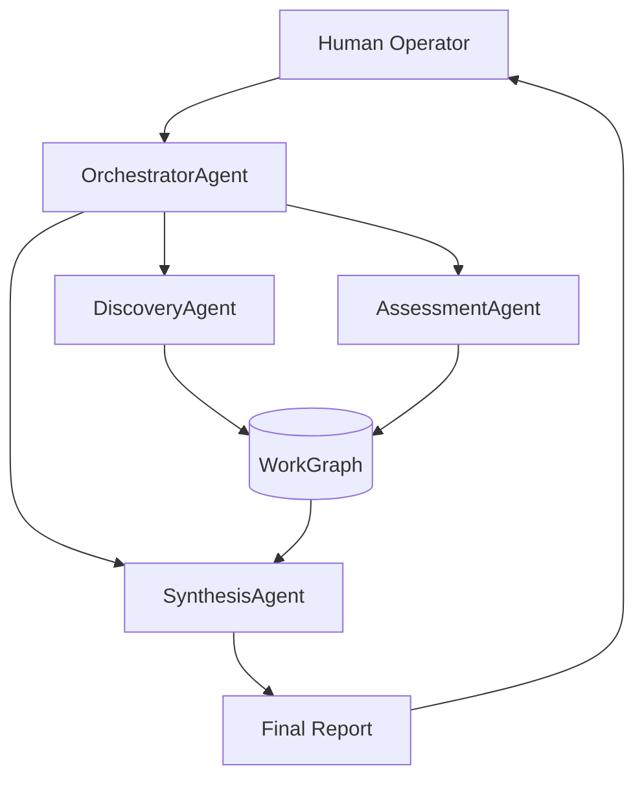
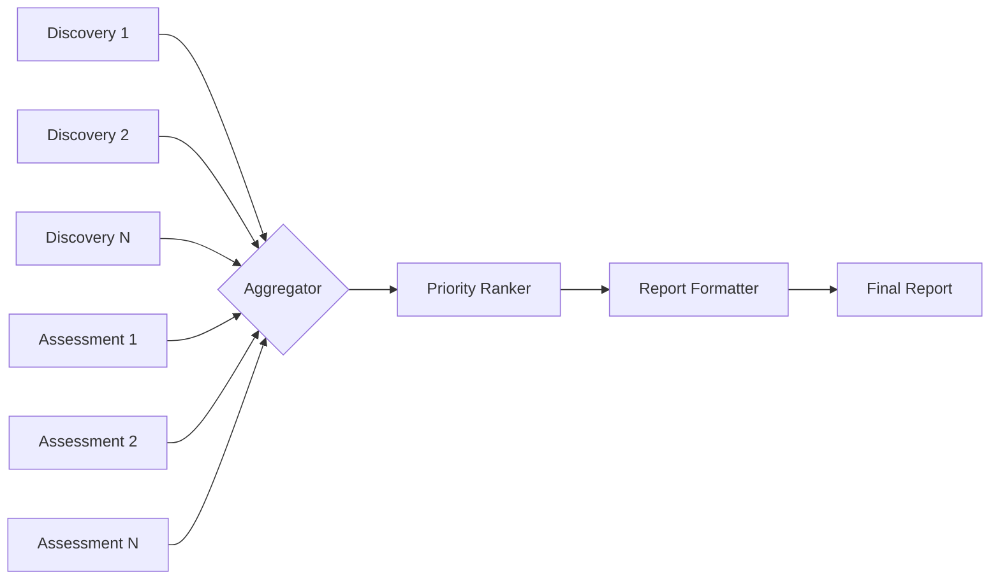

# Agent-Driven Architecture Assessment

This document demonstrates **rmdp** — a Rapid Serial Visual Presentation reader purpose-built for consuming structured, agent-authored technical documents at high speed.

The key insight: most agent output follows predictable structural patterns. Headers delineate concerns. Code blocks provide implementation specifics. Diagrams map relationships. Prose connects the pieces. **rmdp** exploits this regularity to maximize human bandwidth.

## Executive Summary

The proposed system uses a **multi-agent orchestration layer** to coordinate specialized sub-agents across three domains: *discovery*, *assessment*, and *synthesis*. Each agent operates within a constrained context window, communicating via a shared `WorkGraph` data structure.

Key findings:

- Token throughput scales linearly with agent count up to ~8 concurrent agents
- Quality degrades beyond 12 agents due to `WorkGraph` contention
- The `SynthesisAgent` is the critical bottleneck — it must ingest all prior work
- Estimated cost: $0.04 per assessment cycle at current API pricing

## System Architecture

### Overview

The architecture follows a **hub-and-spoke** pattern. The `OrchestratorAgent` sits at the center, dispatching tasks to specialized workers and collecting their outputs into a unified assessment.



Each spoke agent is **stateless** between invocations — all persistent state lives in the `WorkGraph`. This makes agents independently restartable and horizontally scalable.

### The WorkGraph

The `WorkGraph` is the central nervous system. It is a directed acyclic graph (DAG) where:

- **Nodes** represent discrete units of work (a file analyzed, a pattern identified, a risk flagged)
- **Edges** represent dependencies or relationships between units
- **Metadata** on each node tracks provenance, confidence scores, and timestamps

```typescript
interface WorkNode {
  id: string;
  type: 'discovery' | 'assessment' | 'synthesis';
  content: string;
  confidence: number;       // 0.0 – 1.0
  agent: string;            // which agent produced this
  timestamp: number;
  dependencies: string[];   // IDs of upstream nodes
  tags: string[];
}

interface WorkGraph {
  nodes: Map<string, WorkNode>;
  edges: Array<[string, string]>;

  /** Add a node, automatically resolving dependency edges */
  addNode(node: WorkNode): void;

  /** Query nodes by type, tag, or confidence threshold */
  query(filter: WorkGraphFilter): WorkNode[];

  /** Topological sort for synthesis consumption order */
  topoSort(): WorkNode[];
}
```

The `query` method is particularly important for the `SynthesisAgent` — it allows selective ingestion based on confidence thresholds, preventing low-quality discoveries from polluting the final report.

### Agent Lifecycle

Each agent follows a strict lifecycle protocol:

1. **Initialize** — Receive task descriptor from `OrchestratorAgent`
2. **Fetch Context** — Pull relevant `WorkGraph` nodes via `query()`
3. **Execute** — Perform specialized analysis within token budget
4. **Emit** — Write results back to `WorkGraph` as new nodes
5. **Report** — Return status + cost metrics to orchestrator

```python
class BaseAgent:
    def __init__(self, config: AgentConfig):
        self.config = config
        self.token_budget = config.max_tokens
        self.tokens_used = 0

    async def run(self, task: TaskDescriptor, graph: WorkGraph) -> AgentResult:
        context = graph.query(self.build_filter(task))
        self.validate_budget(context)

        result = await self.execute(task, context)

        for node in result.nodes:
            graph.addNode(node)

        return AgentResult(
            status='complete',
            nodes_produced=len(result.nodes),
            tokens_used=self.tokens_used,
            cost=self.compute_cost()
        )

    async def execute(self, task: TaskDescriptor, context: list[WorkNode]) -> ExecutionResult:
        raise NotImplementedError("Subclasses must implement execute()")
```

> **Design Note:** The `validate_budget` call is critical. Without it, an agent given a large context could silently exceed token limits, producing truncated or degraded output. The budget validator raises `BudgetExceededError` before execution begins if the context alone would consume more than 60% of the token budget, leaving room for the actual analysis.

## Discovery Agent

The `DiscoveryAgent` performs the initial sweep of the target codebase or document corpus. It operates in a **breadth-first** pattern:

1. Enumerate top-level structure (directories, modules, chapters)
2. For each structural unit, produce a `DiscoveryNode` with:
   - A one-paragraph summary
   - Detected patterns and anti-patterns
   - Cross-references to related units
   - A confidence score reflecting analysis depth

### Pattern Detection

Pattern detection uses a **template matching** approach. The agent carries a library of ~40 known patterns (e.g., `singleton`, `repository`, `event-sourcing`, `god-class`) and scores each structural unit against them.

```typescript
const PATTERN_LIBRARY: PatternTemplate[] = [
  {
    name: 'repository',
    signals: ['implements CRUD', 'database abstraction', 'entity mapping'],
    antiSignals: ['direct SQL in handlers', 'mixed concerns'],
    weight: 0.8,
  },
  {
    name: 'god-class',
    signals: ['> 500 lines', '> 10 public methods', 'mixed responsibilities'],
    antiSignals: ['single responsibility', 'focused interface'],
    weight: 0.9,  // high weight = high confidence when matched
  },
  // ... 38 more patterns
];

function scorePatterns(unit: StructuralUnit): PatternMatch[] {
  return PATTERN_LIBRARY
    .map(template => ({
      pattern: template.name,
      score: computeMatchScore(unit, template),
      evidence: extractEvidence(unit, template),
    }))
    .filter(match => match.score > 0.3)
    .sort((a, b) => b.score - a.score);
}
```

### Cost Characteristics

The `DiscoveryAgent` is the **most expensive** agent in the pipeline because it must process the entire input corpus. Empirical measurements:

| Corpus Size    | Tokens Used | Time (s) | Cost ($) |
|----------------|-------------|-----------|----------|
| Small (< 10k)  | ~8,000      | 2.1       | 0.002    |
| Medium (10–50k) | ~35,000     | 8.4       | 0.009    |
| Large (50–200k) | ~120,000    | 24.7      | 0.030    |
| XL (200k+)     | ~400,000    | 82.3      | 0.100    |

For XL corpora, the orchestrator automatically **shards** the input across multiple `DiscoveryAgent` instances, each processing a disjoint subset.

## Assessment Agent

The `AssessmentAgent` consumes `DiscoveryNode` outputs and applies evaluative criteria. Where the `DiscoveryAgent` asks *"what is here?"*, the `AssessmentAgent` asks *"is it good?"*

### Evaluation Dimensions

Assessment operates across five dimensions:

- **Correctness** — Does the code/design achieve its stated goal?
- **Maintainability** — How easy is it to modify safely?
- **Performance** — Are there obvious bottlenecks or scaling concerns?
- **Security** — Are there vulnerabilities or unsafe patterns?
- **Coherence** — Does this unit fit within the broader system design?

Each dimension receives a score from 0.0 to 1.0, plus a free-text rationale. The `SynthesisAgent` later aggregates these into an overall health score.

```python
@dataclass
class DimensionScore:
    dimension: str          # e.g., "correctness"
    score: float            # 0.0 – 1.0
    rationale: str          # free-text explanation
    evidence: list[str]     # specific code/doc references
    suggestions: list[str]  # actionable improvement items

class AssessmentAgent(BaseAgent):
    DIMENSIONS = ['correctness', 'maintainability', 'performance', 'security', 'coherence']

    async def execute(self, task, context):
        scores = []
        for dim in self.DIMENSIONS:
            prompt = self.build_dimension_prompt(dim, task, context)
            response = await self.llm.complete(prompt)
            scores.append(self.parse_dimension_response(dim, response))
        
        return ExecutionResult(
            nodes=[self.build_assessment_node(task, scores)]
        )
```

## Synthesis Agent

The `SynthesisAgent` is the **final aggregator**. It consumes the entire `WorkGraph` and produces the human-readable report.

### Aggregation Strategy



The aggregation follows a three-phase pipeline:

1. **Collection** — `topoSort()` the `WorkGraph` to get all nodes in dependency order
2. **Ranking** — Score each finding by `impact × confidence × actionability`
3. **Formatting** — Structure the report with executive summary, findings by severity, and appendices

### Report Structure

The output report follows a strict template designed for rapid consumption (and, naturally, for re-ingestion by **rmdp**):

```markdown
# Assessment Report: {target}

## Executive Summary
{3-5 sentence overview}

## Critical Findings
{Severity: HIGH, items sorted by impact score}

## Recommendations
{Actionable items, each with effort estimate}

## Detailed Analysis
{Per-component breakdown}

## Appendix: Raw Metrics
{Tables, graphs, raw data}
```

## Operational Considerations

### Error Handling

Agents can fail. The orchestrator implements a **retry-with-backoff** strategy:

```go
func (o *Orchestrator) runWithRetry(ctx context.Context, agent Agent, task Task) (*Result, error) {
    var lastErr error
    for attempt := 0; attempt < o.maxRetries; attempt++ {
        result, err := agent.Run(ctx, task)
        if err == nil {
            return result, nil
        }
        lastErr = err

        if !isRetryable(err) {
            return nil, fmt.Errorf("non-retryable failure on attempt %d: %w", attempt+1, err)
        }

        backoff := time.Duration(attempt+1) * o.baseBackoff
        select {
        case <-time.After(backoff):
            // continue to next attempt
        case <-ctx.Done():
            return nil, ctx.Err()
        }
    }
    return nil, fmt.Errorf("exhausted %d retries: %w", o.maxRetries, lastErr)
}
```

### Monitoring

All agent invocations emit structured telemetry:

- `agent.started` — agent name, task ID, token budget
- `agent.completed` — duration, tokens used, nodes produced, cost
- `agent.failed` — error type, retry count, stack trace
- `graph.mutation` — node added/updated, graph size delta

This telemetry feeds into a dashboard that shows real-time pipeline health and cumulative cost tracking.

## Conclusion

The multi-agent architecture provides a scalable, cost-effective approach to automated codebase assessment. The key design decisions — stateless agents, centralized `WorkGraph`, strict lifecycle protocol — enable horizontal scaling while maintaining output quality.

**Next steps:**

1. Implement the `WorkGraph` persistence layer (currently in-memory only)
2. Add a `ValidationAgent` that cross-checks assessment findings
3. Build the telemetry dashboard
4. Run the pipeline against 10 open-source projects of varying size to calibrate confidence thresholds

---

*This document was structured for consumption with rmdp. Headers delineate logical sections. Code blocks provide implementation reference. Diagrams map component relationships. Prose connects the narrative. Each section is self-contained enough for independent RSVP consumption while maintaining a coherent overall arc.*