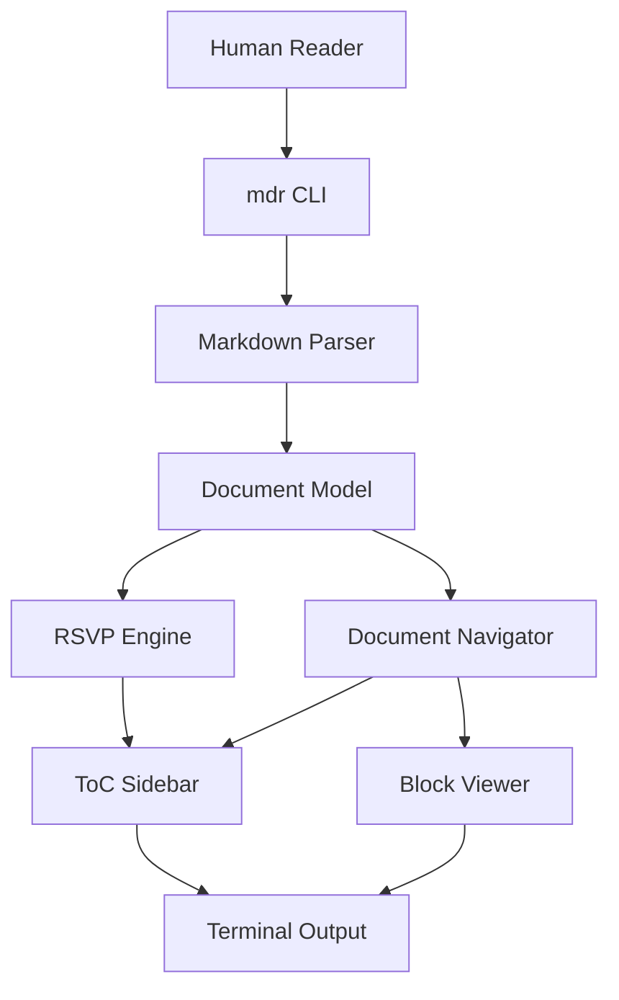
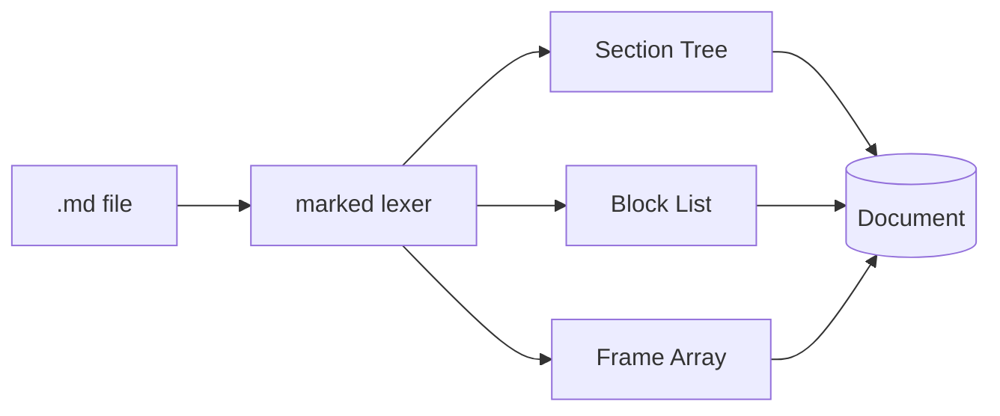
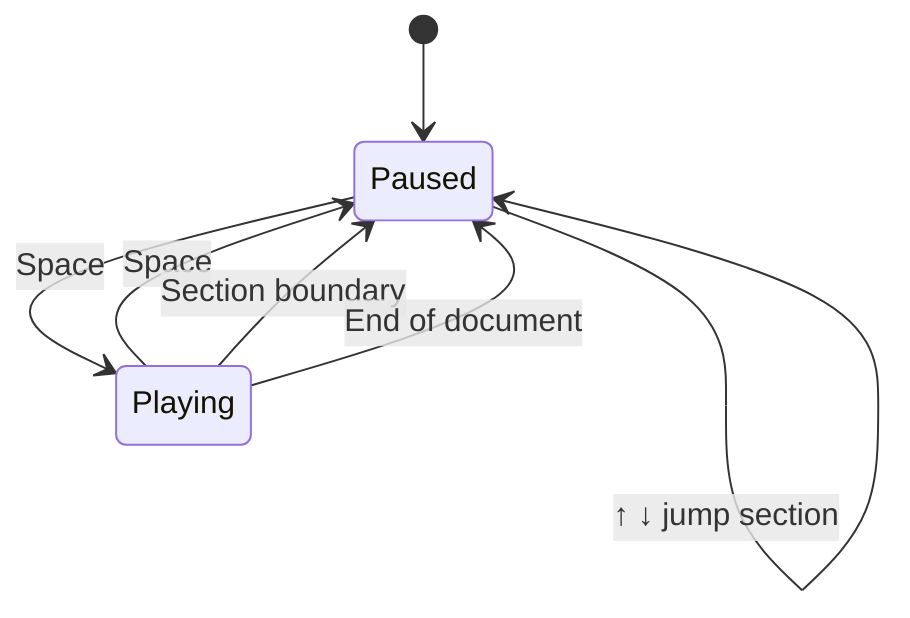

# mdr Feature Showcase

This document exercises every rendering feature of **mdr**. Use it as a first-pass sanity check after making changes. Each section targets a specific capability. Read it at speed to test RSVP, pause to inspect visual blocks.

## RSVP Prose

This section tests the core reading experience. The quick brown fox jumps over the lazy dog. Here is a longer sentence that should trigger the smart pause on the comma, and also at the end. **Bold text** should appear styled in the ORP display. *Italic text* is also supported inline. Inline code like `myFunction()` gets bracket treatment and a green tint.

Paragraph breaks get a 2.5× pause multiplier — you should feel the gap between this sentence and the next paragraph.

Short words: I am on a bus. Long words: internationalization, encapsulation, asynchronously. Very long: incomprehensibility. Punctuation pauses: wait; then stop. Ellipsis… and em-dash — both slow the reader down.

## Syntax Highlighting

### TypeScript

```typescript
interface ApiResponse<T> {
  data: T;
  status: number;
  message: string;
  timestamp: number;
}

async function fetchUser(id: string): Promise<ApiResponse<User>> {
  const res = await fetch(`/api/users/${id}`);
  if (!res.ok) {
    throw new Error(`HTTP ${res.status}: ${res.statusText}`);
  }
  return res.json() as Promise<ApiResponse<User>>;
}

// Type narrowing with discriminated unions
type Result<T> =
  | { ok: true; value: T }
  | { ok: false; error: string };

function unwrap<T>(result: Result<T>): T {
  if (!result.ok) throw new Error(result.error);
  return result.value;
}
```

### Python

```python
from dataclasses import dataclass, field
from typing import Iterator
import asyncio

@dataclass
class TokenBudget:
    limit: int
    used: int = 0
    reserved: list[str] = field(default_factory=list)

    @property
    def remaining(self) -> int:
        return self.limit - self.used

    def consume(self, n: int, label: str = "") -> bool:
        if n > self.remaining:
            return False
        self.used += n
        if label:
            self.reserved.append(f"{label}:{n}")
        return True

async def stream_tokens(prompt: str) -> Iterator[str]:
    """Yield tokens from the model as they arrive."""
    async with client.stream("POST", "/completions", json={"prompt": prompt}) as r:
        async for chunk in r.aiter_text():
            yield chunk
```

### Go

```go
package main

import (
    "context"
    "fmt"
    "sync"
    "time"
)

type WorkerPool struct {
    jobs    chan func()
    wg      sync.WaitGroup
    once    sync.Once
}

func NewWorkerPool(size int) *WorkerPool {
    p := &WorkerPool{jobs: make(chan func(), size*2)}
    for i := 0; i < size; i++ {
        go p.worker()
    }
    return p
}

func (p *WorkerPool) worker() {
    for fn := range p.jobs {
        fn()
        p.wg.Done()
    }
}

func (p *WorkerPool) Submit(ctx context.Context, fn func()) error {
    p.wg.Add(1)
    select {
    case p.jobs <- fn:
        return nil
    case <-ctx.Done():
        p.wg.Done()
        return ctx.Err()
    }
}
```

### Rust

```rust
use std::collections::HashMap;
use std::sync::{Arc, Mutex};

#[derive(Debug, Clone)]
pub struct Cache<K, V> {
    store: Arc<Mutex<HashMap<K, (V, std::time::Instant)>>>,
    ttl: std::time::Duration,
}

impl<K, V> Cache<K, V>
where
    K: Eq + std::hash::Hash + Clone,
    V: Clone,
{
    pub fn new(ttl_secs: u64) -> Self {
        Self {
            store: Arc::new(Mutex::new(HashMap::new())),
            ttl: std::time::Duration::from_secs(ttl_secs),
        }
    }

    pub fn get(&self, key: &K) -> Option<V> {
        let store = self.store.lock().unwrap();
        store.get(key).and_then(|(val, ts)| {
            if ts.elapsed() < self.ttl { Some(val.clone()) } else { None }
        })
    }

    pub fn set(&self, key: K, value: V) {
        let mut store = self.store.lock().unwrap();
        store.insert(key, (value, std::time::Instant::now()));
    }
}
```

### Shell

```bash
#!/usr/bin/env bash
set -euo pipefail

# Deploy script — builds, tags, and pushes docker image
IMAGE="${REGISTRY}/${PROJECT}:${VERSION:-latest}"

echo "Building ${IMAGE}..."
docker build \
  --build-arg BUILD_DATE="$(date -u +%Y-%m-%dT%H:%M:%SZ)" \
  --build-arg VCS_REF="$(git rev-parse --short HEAD)" \
  --tag "${IMAGE}" \
  --file Dockerfile \
  .

if [[ "${PUSH:-false}" == "true" ]]; then
  docker push "${IMAGE}"
  echo "Pushed ${IMAGE}"
fi
```

### SQL

```sql
-- Find the top 10 sections by word count with section metadata
WITH section_stats AS (
  SELECT
    s.id,
    s.title,
    s.level,
    COUNT(f.id)          AS word_count,
    AVG(f.pause_mult)    AS avg_pause,
    MAX(f.pause_mult)    AS max_pause
  FROM sections s
  JOIN frames f ON f.section_id = s.id
  WHERE f.is_heading = FALSE
  GROUP BY s.id, s.title, s.level
)
SELECT
  title,
  word_count,
  ROUND(avg_pause, 2)   AS avg_pause,
  ROUND(word_count / 200.0, 1) AS est_minutes
FROM section_stats
ORDER BY word_count DESC
LIMIT 10;
```

## Tables

### Simple Two-Column

A minimal table — tests the basic header/separator/row rendering path.

| Key | Description |
|-----|-------------|
| `Space` | Play / Pause |
| `←` `→` | Step one word |
| `[` `]` | WPM −25 / +25 |
| `j` `k` | Next / Prev section |
| `Tab` | Toggle document view |
| `?` | Help overlay |
| `q` | Quit |

### Wide Multi-Column

Tests column width calculation across many columns with varying cell lengths.

| Component | Responsibility | Key Files | Status |
|-----------|---------------|-----------|--------|
| RSVP Engine | Timer loop, frame advance, speed control | `use-rsvp.ts` | Stable |
| Document Nav | Section/block traversal, frame sync | `use-document.ts` | Stable |
| ToC Sidebar | ORP word display, context buffer, section tree | `toc-sidebar.tsx` | Active |
| Block Viewer | Code/diagram rendering, tab nav, pinning | `block-viewer.tsx` | Active |
| Parser | Markdown → Document model | `parser.ts` | Stable |
| Status Bar | WPM, progress, time remaining | `status-bar.tsx` | Stable |

### Uneven Cell Lengths

Stress-tests the column width algorithm — some cells are very short, others long.

| Language | Paradigm | Typing | Killer Feature |
|----------|----------|--------|----------------|
| TypeScript | Multi-paradigm | Static, structural | Type inference + generics |
| Python | Multi-paradigm | Dynamic, duck | Readability + ecosystem |
| Go | Imperative | Static, nominal | Goroutines + simplicity |
| Rust | Systems | Static, affine | Ownership + zero-cost abstractions |
| SQL | Declarative | Static | Set operations on structured data |
| Bash | Scripting | Dynamic | Glue — pipes and process composition |

### Inline Code in Cells

| Pattern | Usage | Example |
|---------|-------|---------|
| `useState` | Local component state | `const [v, setV] = useState(0)` |
| `useEffect` | Side effects and subscriptions | `useEffect(() => { ... }, [dep])` |
| `useMemo` | Expensive derived values | `useMemo(() => compute(x), [x])` |
| `useCallback` | Stable function references | `useCallback((e) => fn(e), [fn])` |
| `useRef` | Mutable ref without re-render | `const ref = useRef<T>(null)` |

## Mermaid Diagrams

### Flowchart — Top Down



### Flowchart — Left Right



### State Diagram



## Inline Formatting in RSVP

This section tests that inline formatting flags survive the parser → frame pipeline. **Bold words** should render bold in the ORP display. *Italic words* should render italic. Mixed **bold and *italic*** is trickier. Inline code spans like `renderMermaidASCII()` and `splitAtOrp()` get the green bracket treatment.

Heading words are skipped by the RSVP engine — the section title above should not have appeared in the word stream. The ToC sidebar surfaces it instead.

## Long Section

This section has enough words to test the context buffer, smart pacing, and the progress indicators. The RSVP engine should pace through this paragraph at the configured WPM, slowing at sentence boundaries and paragraph breaks.

Agent-authored documents benefit most from RSVP when they are written with structural regularity. Short sentences. Direct claims. Evidence following assertions. The reader's eye stays fixed while meaning flows past at a controlled rate.

The context buffer below the ORP word shows two lines of surrounding text: the words before the current position fill line one, and the current word anchors line two with following words trailing to the right. During playback this is blank to reduce noise. On pause it snaps into view for quick orientation before manual stepping or resuming.

Smart pacing adjusts the inter-word delay based on word characteristics. Sentence-ending punctuation gets a 2× multiplier. Commas and semicolons get 1.4×. Paragraph boundaries get 2.5×. Long words — anything over twelve characters — get a 1.3× multiplier to allow more processing time. Inline code tokens also get extra time since they require more cognitive effort to parse.

---

*This document is the primary test surface for mdr. When adding a new feature, add a representative example here. See CLAUDE.md for the contribution convention.*
